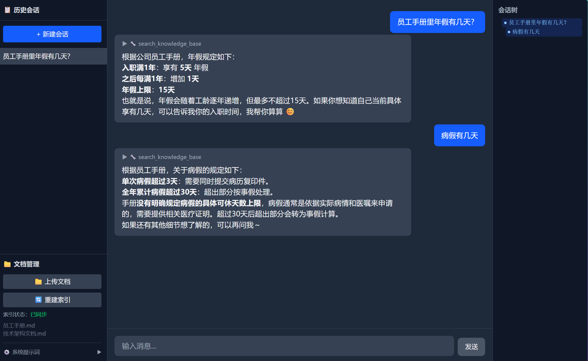
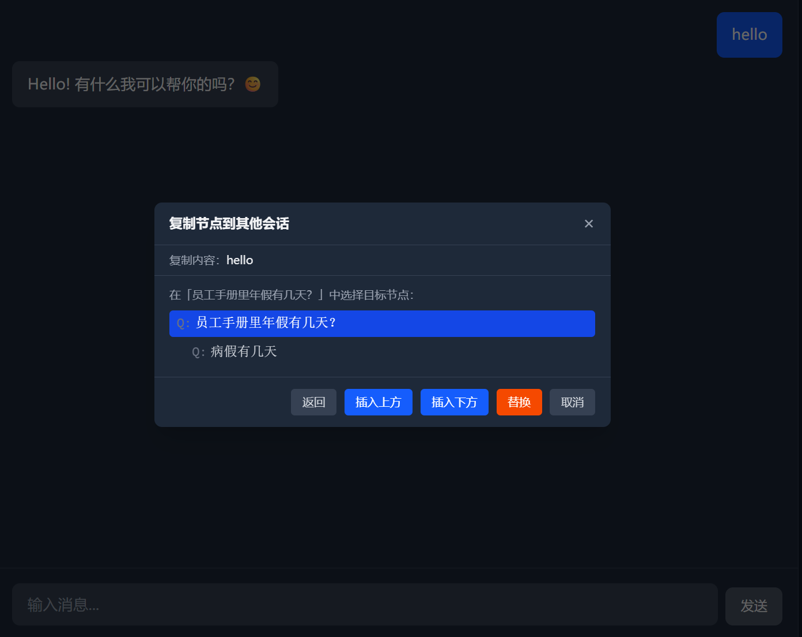

<div align="center">

# AIDev

**从"聊天机器人"到"企业知识助手"的一站式实践**

一个完整的企业级 RAG Agent 项目 — 不是玩具 Demo，而是涵盖语义分块、混合检索、精排、
会话树分支、工具调用可视化的生产级全栈实现。

[快速开始](#快速开始) · [技术架构](#架构) · [功能演示](#功能演示)

</div>

---

## 为什么做这个项目？

市面上的 RAG 教程大多停在"把文档塞进向量库然后相似度检索"——这在真实场景中远远不够。AIDev 是一个**从零构建、逐步迭代**的完整实践，解决了以下问题：

- **检索质量**：纯向量检索召回率不足？→ HyDE 假设文档 + 多查询扩展 + BM25/向量混合检索 + CrossEncoder 精排 + 父子块层级检索
- **对话体验**：对话是线性的没法回头？→ 树状会话分支，编辑问题生成新分支，右侧栏可视化导航
- **工具透明度**：AI 说了什么不知道？→ SSE 流式打字机 + 工具调用过程实时可视化（可折叠）
- **全栈工程**：不是 Jupyter Notebook 里跑两行代码 — FastAPI 后端 + React 19 前端 + SQLite 持久化 + 完整 CRUD

## 架构

```
┌─────────────────────────────────────────────────┐
│                    AIDev                        │
│                                                 │
│  ┌─ CLI ────────────────────────────────────┐   │
│  │  main.py → AgentExecutor (LangChain)     │   │
│  └──────────────────────────────────────────┘   │
│                                                 │
│  ┌─ Web ────────────────────────────────────┐   │
│  │  frontend (Vite + React 19 + Tailwind)   │   │
│  │    │ POST /api/chat/stream (SSE)         │   │
│  │    ▼                                     │   │
│  │  backend/web_server.py (FastAPI)         │   │
│  │    │                                     │   │
│  │    ▼                                     │   │
│  │  create_react_agent (LangGraph)          │   │
│  │    │                                     │   │
│  │    ├── search_knowledge_base (RAG)       │   │
│  │    ├── get_weather (wttr.in)             │   │
│  │    └── calculate (AST safe-eval)         │   │
│  └──────────────────────────────────────────┘   │
│                                                 │
│  ┌─ 共享基础设施 ────────────────────────────┐   │
│  │  ChromaDB (向量库) + SQLite (会话历史)    │   │
│  │  Ollama (Qwen3-Embedding + Reranker)     │   │
│  └──────────────────────────────────────────┘   │
└─────────────────────────────────────────────────┘
```

## 检索增强 — 六层流水线

这是本项目最核心的部分。一次用户查询会经历以下全部流程，每一层都可以通过 `.env` 独立调节或关闭：

```
用户查询 "公司考勤制度"
    │
    ▼
[1] HyDE ─── 短查询？先让 LLM 生成假设答案，用假设答案的 Embedding 检索（语义更丰富）
    │
    ▼
[2] 多查询 ── LLM 将问题扩展为 N 个不同角度，并行检索后合并去重
    │
    ▼
[3] 混合检索 ─ BM25 (关键词) + 向量检索 (语义) 双路召回，α 加权融合
    │
    ▼
[4] CrossEncoder 精排 ─ Qwen3-Reranker 对候选文档逐一打分，取 Top-K
    │
    ▼
[5] 父块提升 ── 命中子块 → 自动返回父块（子块精准匹配 + 父块完整上下文）
    │
    ▼
[6] 滑动窗口 ── 注入最近 N 对历史对话 + 系统提示词，传入 Agent
```

| 层级 | 技术 | 配置开关 |
|------|------|----------|
| 语义分块 | Embedding 相似度检测语义边界 | `CHUNK_METHOD=semantic` |
| HyDE | 短查询生成假设答案 | `HYDE_ENABLED=true` |
| 多查询 | LLM 扩展 N 个查询角度 | `MULTI_QUERY_COUNT=3` |
| 混合检索 | BM25 + 向量双路 α 融合 | `RETRIEVER_HYBRID_ALPHA=0.3` |
| 精排 | Qwen3-Reranker CrossEncoder | `RERANKER_ENABLED=true` |
| 层级检索 | 子块→父块提升 | `PARENT_CHUNK_SIZE=4` |

所有参数均可在 `.env` 中调整，详见 [`.env.example`](backend/.env.example)。

## 功能演示

### ChatGPT 级别的对话体验



| 功能 | 说明 |
|------|------|
| 流式打字机输出 | SSE 逐 token 推送，支持中途 `⏹ 停止` |
| 工具调用可视化 | 检索/计算过程实时展示，可折叠查看详情 |
| 会话树分支 | 编辑问题生成新分支，右侧栏树状导航 |
| 节点操作 | 删除（子节点自动重挂载）/ 复制到其他会话 |
| 文档管理 | Web UI 上传文件 + 一键重建索引 |
| 系统提示词 | 全局可编辑角色指令，两层架构（工具说明 + 用户自定义） |

### 会话树 — 不是线性聊天，而是思维导图



编辑已发送的问题会自动创建分支，右侧栏实时渲染完整对话树。每个分支节点支持删除和跨会话复制（上方插入/下方插入/替换三种模式）。

## 快速开始

### 前置条件

| 依赖 | 版本要求 | 用途 |
|------|----------|------|
| Python | >= 3.12 | 后端运行时 |
| [uv](https://docs.astral.sh/uv/) | >= 0.11.0 | Python 包管理 |
| Node.js | >= 18 | 前端构建 |
| [Ollama](https://ollama.com) | >= 0.18.2 | 本地 Embedding + Reranker |

### 1. 安装 Ollama 模型

```bash
# ① 拉取基础 Embedding 模型（Qwen3-Embedding 0.6B Q8_0）
ollama pull dengcao/Qwen3-Embedding-0.6B:Q8_0

# ② 创建低上下文版本（解决 Ollama KV 缓存 OOM，零额外磁盘占用）
echo "FROM dengcao/Qwen3-Embedding-0.6B:Q8_0
PARAMETER num_ctx 512" | ollama create qwen3-embed:0.6b-q8_0-ctx512 -f -
```

### 2. 配置后端

```bash
cd backend
uv venv --python 3.12
uv sync
cp .env.example .env   # 编辑 .env，填入 LLM API Key 和端点
```

`.env` 中必须配置的项目：

```env
LLM_MODEL=deepseek-v4-flash          # 任意 OpenAI 兼容模型
OPENAI_API_KEY=sk-your-api-key
OPENAI_BASE_URL=https://your-api-endpoint/v1
```

> 不使用 RAG？跳过 Ollama 和索引构建，天气查询和数学计算仍可正常使用。

### 3. 构建向量索引（可选，RAG 功能需要）

将文档放入 `backend/data/documents/`，然后运行：

```bash
cd backend
uv run python -m src.retrieval.index_builder
```

支持 `.pdf`、`.docx`、`.txt`、`.md` 格式。也可以通过 Web UI 的文档管理面板上传。

### 4. 安装前端依赖

```bash
cd frontend
npm install
```

### 启动

```bash
# 终端 1 — 后端
cd backend
uv run uvicorn web_server:app --reload --port 8000

# 终端 2 — 前端
cd frontend
npm run dev
```

浏览器打开 `http://localhost:5173`。

## 项目结构

```
AIDev/
├── backend/                         # Python 后端
│   ├── main.py                      # CLI 入口
│   ├── web_server.py                # FastAPI 入口
│   ├── api/                         # Web API 路由
│   │   ├── chat.py                  # SSE 流式端点
│   │   ├── sessions.py              # 会话 & 消息 CRUD + 树结构 + 节点复制
│   │   ├── documents.py             # 文档上传 + 索引重建
│   │   └── memory.py                # 系统提示词 CRUD
│   ├── src/
│   │   ├── agent/
│   │   │   ├── agent.py             # LangGraph create_react_agent
│   │   │   ├── tools.py             # 工具定义（知识库/天气/计算）
│   │   │   └── memory.py            # 用户画像
│   │   ├── ingestion/
│   │   │   ├── loader.py            # 文档加载（PDF/DOCX/TXT/MD）
│   │   │   └── chunker.py           # 语义分块 / 固定分块
│   │   └── retrieval/
│   │       ├── rag_chain.py         # RAG 检索链（六层流水线）
│   │       ├── index_builder.py     # 向量索引构建
│   │       ├── hybrid_retriever.py  # BM25 + 向量混合检索
│   │       ├── reranker.py          # CrossEncoder 精排
│   │       └── bm25.py              # BM25 检索
│   ├── .env.example                 # 配置模板（所有参数均有注释）
│   ├── tests/
│   └── pyproject.toml
├── frontend/                        # React 19 + TypeScript + Tailwind v4
│   └── src/
│       ├── components/
│       │   ├── chat/                # 消息气泡 + 输入框 + 复制模态框
│       │   ├── sidebar/             # 会话列表 + 文档管理 + 系统提示词
│       │   └── tree/                # 会话树（纯 React 递归渲染）
│       └── lib/
│           ├── api.ts               # SSE 流式读取 + API 封装
│           └── AppContext.tsx        # React Context 状态管理
└── plan.md                          # 完整设计文档（33 项决策记录）
```

## 技术栈

| 层 | 技术 |
|----|------|
| Agent | LangGraph `create_react_agent` + 3 自定义工具 |
| RAG | ChromaDB + Ollama Qwen3-Embedding + Qwen3-Reranker |
| 后端 | FastAPI + SSE + SQLite |
| 前端 | Vite + React 19 + TypeScript + Tailwind CSS v4 |
| 包管理 | uv (Python) / npm (前端) |

## 测试

```bash
cd backend
uv run pytest                    # 全量运行 (27 tests)
uv run pytest -k "rag"           # 仅 RAG 检索测试
uv run pytest -k "calculator"    # 仅计算器安全测试
```

## 常见问题

### Ollama Embedding 报错 "memory layout cannot be allocated"

Qwen3-Embedding 声明了 32768 上下文窗口，Ollama 预分配 ~736MB KV 缓存，Windows 上可能因内存碎片化失败。解决：用 Modelfile 创建 `num_ctx=512` 版本（同权重，零额外磁盘）：

```bash
echo "FROM dengcao/Qwen3-Embedding-0.6B:Q8_0
PARAMETER num_ctx 512" | ollama create qwen3-embed:0.6b-q8_0-ctx512 -f -
```

### NumPy/OpenBLAS 内存分配失败

```powershell
$env:OMP_NUM_THREADS=1; $env:OPENBLAS_NUM_THREADS=1; python main.py
```

## License

MIT
